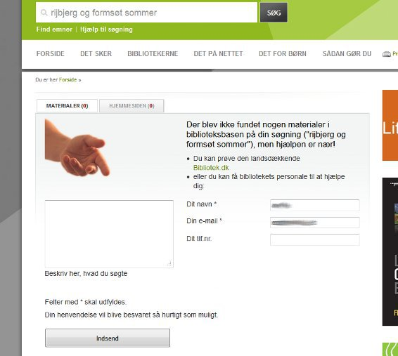

Description
-----------
The module provides a form presented to the user after a search resulting in zero hits.

 

Installation
------------

Download and enable the module. Ding! Zerohit form depends on webform being installed. 

Configuration of the module
---------------------------

### Settings in the administration section (/admin/settings/ting/zerohitform)

* "Webform ID": Points to an existing webform on the website. 

Forms have been provided with the module, and Webform ID will be set to one of these by standard.

Usage and Tips
--------------

### E-mail settings

Typically, a library will want to send the emails submitted from this form to specific e-mail accounts monitored by library staff:

* Go to admin/content/webform,
* click the "edit"-link next to relevant webform (f.ex. "Zero-hit form"), 
* click the tab "Webform", 
* click the tab "E-mails", 
* click "edit" on the e-mail already set up and change it to the needed value

More information on configuring webform can be found at [http://drupal.org/documentation/modules/webform](http://drupal.org/documentation/modules/webform).  

